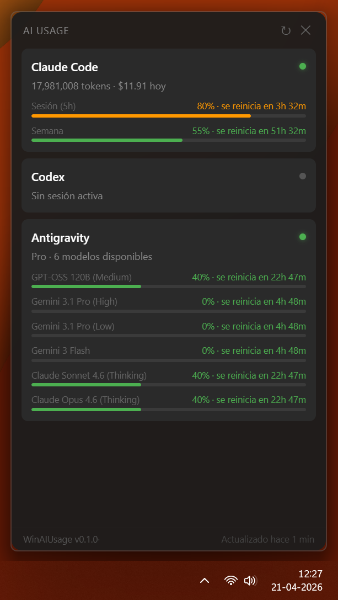
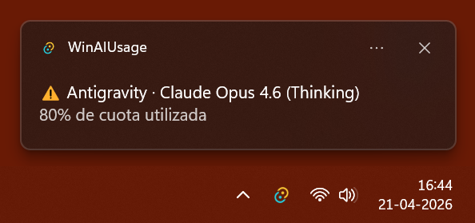

# 🤖 WinAIUsage

[](https://opensource.org/licenses/MIT)

A modern Windows system tray app that monitors your AI tool usage in real time — tokens, costs, and quotas at a glance.

<p align="center">
  
</p>
<p align="center">
  
</p>

---

## ✨ Features

- **Claude Code** — daily token count, estimated cost, 5-hour session bar, weekly quota bar, and peak-hour status
- **Codex** — session and weekly quota monitoring
- **Antigravity** — per-model quota in real time via the local language server RPC
- **Smart Notifications** — native Windows toasts when you hit 80% or 99% of your quotas
- **Customizable** — settings modal to toggle providers, notifications, and run on startup
- **Bilingual** — automatically detects and adapts to English or Spanish systems
- **Modern design** — no window decorations, semi-transparent dark popup, Windows 11 feel
- **Lives in the tray** — no taskbar clutter, opens on click, hides on focus loss, with optional window pinning
- **Auto-polling** every 5 minutes with a manual refresh button
- **Ultra-lightweight** — uses barely ~8MB of RAM thanks to its Rust/Tauri backend

---

## 📦 Supported Providers

| Provider | Status | Data source |
|---|---|---|
| Claude Code | ✅ | OAuth API + local JSONL files |
| Antigravity | ✅ | Local language server (Connect RPC) |
| Codex | ✅ | Codex CLI tokens + ChatGPT API |

---

## 🖥️ Requirements

- Windows 10 / 11 x64
- [Antigravity](https://antigravity.dev) running locally for its provider

---

## 📥 Installation

Download the latest installer from [Releases](https://github.com/AxelDreemurr/WinAIUsage/releases):

- `winaiusage_x.x.x_x64-setup.exe` — NSIS installer (recommended)
- `winaiusage_x.x.x_x64_en-US.msi` — MSI package

---

## 🛠️ Local Development

**Prerequisites:** [Rust](https://rustup.rs), [Node.js](https://nodejs.org), npm

```bash
git clone https://github.com/AxelDreemurr/WinAIUsage.git
cd WinAIUsage
npm install
npm run tauri dev
```

---

## 🧱 Stack

- [Tauri 2](https://tauri.app) (Rust) — tray icon, system integration, provider logic
- [React](https://react.dev) + [TypeScript](https://www.typescriptlang.org) — popup UI
- [Vite](https://vitejs.dev) — frontend tooling

---

## 🙌 Usage Policy

This project is open source for learning and contribution purposes. You are welcome to fork and modify for personal use, but please don't redistribute a copy as your own standalone product without significant changes.

---

## 📄 License

[MIT](LICENSE)

---

<p align="center">
  Developed by <a href="https://axeldreemurr.cl">@AxelDreemurr</a>
</p>
